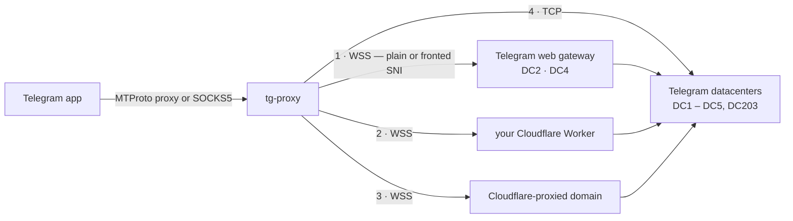

<div align="center">


<br>

**One small binary. No server to rent, no VPN, no account.**<br>
It tunnels Telegram through routes that censors rarely block, and tells you which of them work on *your* network.

<br>

[](https://github.com/AlexMelanFromRingo/tg-proxy/releases)
[](https://github.com/AlexMelanFromRingo/tg-proxy/actions)
[](LICENSE)
[](https://www.rust-lang.org)
[](docs/FUNDING.md)

**English** · [Русский](README.ru.md)

</div>

---

## Highlights

- 🛰️ **Five routes, one proxy.** Direct WebSocket to Telegram's own gateway, the same with *SNI fronting*, a free **Cloudflare Worker**, Cloudflare‑proxied domains, and plain TCP — tried in that order, with failures remembered so a blocked path costs one slow attempt, not one per connection.
- 🩺 **`tg-proxy --check`** performs a *real* MTProto handshake with Telegram over every route and tells you what works on your network, per datacenter. No more guessing.
- 📱 **MTProto proxy and SOCKS5** in one process. Add it to Telegram with one click on a `tg://proxy` link; share it with phones on your Wi‑Fi.
- 🎭 **Fake TLS** (`ee` secrets) with active‑probe masking and replay protection, for when you host it for others.
- 🔗 **Works with what you already have.** `--upstream-socks5` sends everything through an existing tunnel (Xray, sing‑box, Shadowsocks, Tor…).
- 🔒 **Strict where it counts.** Certificates are verified even in fronting mode (pinned to `web.telegram.org`); the Worker refuses anything that is not a Telegram address; private domains are masked in logs.
- ⚡ Static ~4 MB binary for Linux, Windows and macOS. Async Rust, no runtime to install.

## Quick start

1. **Download** the binary for your system from [Releases](../../releases) (Linux x86‑64/arm64, Windows, macOS Intel/Apple Silicon).
2. **Run it:**

   ```bash
   chmod +x tg-proxy-linux-x86_64 && ./tg-proxy-linux-x86_64     # Linux / macOS
   tg-proxy-windows-x86_64.exe                                   # Windows
   ```

3. **Click the `tg://proxy?…` link it prints** (or paste it into any Telegram chat and tap it). Telegram offers to add the proxy — confirm.

```
  ╭───────────────────────────────────────────────────────╮
  │  tg-proxy v0.2.0                                      │
  │  Telegram over WebSocket · SNI fronting · Cloudflare  │
  ╰───────────────────────────────────────────────────────╯

  MTProto proxy   127.0.0.1:1443
  SOCKS5 proxy    127.0.0.1:1080
  Routes          direct WS (DC2, DC4) + SNI fronting → CF proxy (community pool) → raw TCP
  Secret          saved in ~/.config/tg-proxy/secret

  Add to Telegram (click the link or paste it into a chat):
    tg://proxy?server=127.0.0.1&port=1443&secret=dd…
    tg://socks?server=127.0.0.1&port=1080
```

The secret is generated once and remembered, so the link stays valid across restarts.

> **Not working?** Run `tg-proxy --check` first. It shows which routes reach Telegram from your network and which Telegram datacenters are covered — see [If it doesn't work](#if-it-doesnt-work).

## How it works



Telegram clients speak MTProto, which censors fingerprint easily. `tg-proxy` re‑wraps it as ordinary HTTPS/WebSocket traffic to addresses that are expensive to block, and keeps trying alternatives when one is cut. The traffic stays MTProto‑encrypted end to end between your Telegram app and Telegram's servers; nothing in the path (including Cloudflare) can read your messages.

| Route | What a censor sees | You need | Covers |
|---|---|---|---|
| **1 · Direct WebSocket** | HTTPS to Telegram's web gateway | nothing | DC2, DC4 |
| **1b · …with SNI fronting** | HTTPS to the same IP under an innocuous server name (switched on automatically when plain connections are cut) | nothing | DC2, DC4 |
| **2 · Cloudflare Worker** | HTTPS to `*.workers.dev` | a free Cloudflare account, 5 minutes → [guide](docs/CLOUDFLARE.md) | all DCs |
| **3 · Cloudflare‑proxied domains** | HTTPS to a Cloudflare‑hosted domain | nothing (community pool) or your own domain | depends on the domain |
| **4 · Raw TCP** | MTProto to Telegram's IPs | nothing | all DCs |

### Which accounts does it cover?

Every Telegram account lives on one datacenter, DC1–DC5. Telegram's WebSocket gateway serves **only DC2 and DC4** (we checked against the live gateway), so accounts on **DC1, DC3, DC5** (and the newer DC203) depend on routes 2–4. That is why a [Cloudflare Worker](docs/CLOUDFLARE.md) is worth setting up if the direct route is blocked for you: it is the one route that reaches every datacenter and does not depend on a third party.

### What it cannot do

- **Voice and video calls** do not go through MTProto proxies of any kind. Use a VPN for calls.
- **A total block.** If your network drops every Telegram *and* every Cloudflare address, no proxy of this kind helps. `--check` will tell you.

## If it doesn't work

```bash
tg-proxy --check
```

```
  Direct WebSocket to Telegram's gateway
    ✘ DC2 plain SNI (kws2.web.telegram.org)         timeout
    ✔ DC2 SNI fronting (sprin*****.ru)              190 ms
  Cloudflare Worker
    ✔ DC1 via my-r****.exa****.wor****.dev          355 ms
    …
  Datacenters
    ✔ DC1    worker
    ✔ DC2    fronted, worker
    ✘ DC3    no working route
```

| You see | Meaning | What to do |
|---|---|---|
| Direct ✘, fronted ✔ | Plain connections are cut, fronting gets through | Nothing — it is used automatically |
| Direct ✘ and fronted ✘ | Telegram's gateway is unreachable | Set up a [Cloudflare Worker](docs/CLOUDFLARE.md) |
| Some DCs show ✘ | Accounts on those datacenters will not connect | Add a Worker, or `--upstream-socks5` |
| Everything ✘ with `timeout` | The machine is offline, or only whitelisted sites are reachable | Check basic connectivity; try `--upstream-socks5` |

## Recipes

<details>
<summary><b>📱 Use it on a phone (same Wi‑Fi)</b></summary>

```bash
tg-proxy --host 0.0.0.0
```

It prints a `tg://proxy` link with your computer's LAN address. Open the link on the phone. The MTProto port is protected by the secret; the SOCKS5 port has **no password**, so use `--port 0` to switch it off on shared networks.
</details>

<details>
<summary><b>☁️ Add a Cloudflare Worker (reaches every datacenter)</b></summary>

Follow [docs/CLOUDFLARE.md](docs/CLOUDFLARE.md), then:

```bash
tg-proxy --cfproxy-worker-domain my-relay.my-name.workers.dev
```

You can pass several Workers (repeat the flag, or separate them with commas) to spread the load. One Worker can serve all your friends — share only its address.
</details>

<details>
<summary><b>🔗 Send everything through an existing tunnel</b></summary>

If you already run Xray, sing‑box, a Shadowsocks client or Tor on the machine and it exposes a local SOCKS5 port:

```bash
tg-proxy --upstream-socks5 127.0.0.1:10808
tg-proxy --upstream-socks5 user:password@127.0.0.1:10808     # with authentication
```

Every outbound connection (Telegram, Cloudflare, the domain‑list download) goes through it, and host names are resolved by the tunnel, not locally.
</details>

<details>
<summary><b>🎭 Host it for others with Fake TLS</b></summary>

```bash
tg-proxy --host 0.0.0.0 --mtproto-port 443 --fake-tls-domain example.com --secret <32 hex chars>
```

Clients get an `ee…` link; probes that fail verification are transparently relayed to the real `example.com`. Details, `nginx` and PROXY protocol: [docs/FAKE_TLS.md](docs/FAKE_TLS.md).
</details>

<details>
<summary><b>🐳 Docker</b></summary>

```bash
docker build -t tg-proxy .
docker run -d --name tg-proxy --restart unless-stopped \
  -p 1443:1443 -e TG_PROXY_SECRET=$(openssl rand -hex 16) tg-proxy
```

The image listens on `0.0.0.0` and has no SOCKS5 listener (`TG_PROXY_HOST` / `TG_PROXY_PORT` defaults). Add options after the image name or as `TG_PROXY_*` variables (see the table below), e.g. `docker run … tg-proxy --cfproxy-worker-domain relay.example.workers.dev`. A secret that is not fixed changes on every container start.
</details>

<details>
<summary><b>🧰 Run as a service (systemd)</b></summary>

```ini
# /etc/systemd/system/tg-proxy.service
[Unit]
Description=tg-proxy
After=network-online.target
Wants=network-online.target

[Service]
ExecStart=/usr/local/bin/tg-proxy --host 0.0.0.0 --port 0
Environment=TG_PROXY_SECRET=00112233445566778899aabbccddeeff
Restart=on-failure
DynamicUser=yes
NoNewPrivileges=yes

[Install]
WantedBy=multi-user.target
```
</details>

## Options

Every option can also be given as an environment variable where one is listed.

| Option | Default | Description |
|---|---|---|
| `--host` · `TG_PROXY_HOST` | `127.0.0.1` | Listen address. `0.0.0.0` shares the proxy on your network. |
| `--mtproto-port` · `TG_PROXY_MTPROTO_PORT` | `1443` | MTProto‑proxy port (`0` = off). |
| `-p, --port` · `TG_PROXY_PORT` | `1080` | SOCKS5 port (`0` = off). |
| `--secret` · `TG_PROXY_SECRET` | generated, remembered | MTProto secret, 32 hex characters. |
| `--check` | | Test every route against Telegram, then exit. |
| `--cfproxy-worker-domain` · `TG_PROXY_WORKER_DOMAINS` | | Your Cloudflare Worker (repeat or comma‑separate). |
| `--cfproxy-domain` · `TG_PROXY_CF_DOMAINS` | community pool | Your own Cloudflare‑proxied domain. |
| `--no-cfproxy` | | Never use Cloudflare‑proxied domains (no third‑party pool). |
| `--no-secure` | | Reach Worker / CF domains over plain port 80 instead of TLS. |
| `--upstream-socks5` · `TG_PROXY_UPSTREAM_SOCKS5` | | Send all outbound connections through `[user:pass@]host[:port]`. |
| `--dc-ip DC:IP` | `2:149.154.167.220 4:149.154.167.220` | Gateway for a datacenter (repeatable). A bare `--dc-ip` turns direct connections off. |
| `--no-direct` | | Same as a bare `--dc-ip`. |
| `--fronting-sni` / `--no-fronting` | `sprinthost.ru` | SNI used when plain connections are cut / disable fronting. |
| `--fake-tls-domain` · `TG_PROXY_FAKE_TLS_DOMAIN` | | Enable Fake TLS disguised as this site. |
| `--proxy-protocol` | | Expect a PROXY protocol v1 header (behind nginx/haproxy). |
| `--force-test-dc` | | Send everything to Telegram's *test* datacenters. |
| `--pool-size` / `--pool-max-age` | `4` / `120` | Pre‑warmed WebSocket connections per DC / their lifetime (s). |
| `--connect-timeout` | `5` | Direct connection timeout (s). |
| `--buf-kb` | `256` | Socket buffer size. |
| `--log-file`, `--log-max-mb`, `--log-backups` | | Mirror the log to a rotated file. |
| `-v, --verbose` | | Debug logging. |
| `--skip-tls-verify` | | ⚠️ Disable certificate verification. Insecure. |

## Security and privacy

- **Local by default.** It listens on `127.0.0.1`. Binding to `0.0.0.0` exposes the SOCKS5 port without a password — keep it on trusted networks or switch it off with `--port 0`.
- **The SOCKS5 passthrough refuses loopback, private and link-local destinations**, so a SOCKS5 port shared on your network cannot be used to reach the proxy machine itself or your LAN.
- **Content stays private.** MTProto encrypts messages between your Telegram app and Telegram's servers. Cloudflare, the Worker, a CF domain or an upstream tunnel can see *metadata* (that you connect, how much, when) but not message content.
- **The community domain pool is third‑party infrastructure.** Out of the box, route 3 uses a pool of Cloudflare‑proxied domains maintained by the original [`tg-ws-proxy`](https://github.com/Flowseal/tg-ws-proxy) project, refreshed hourly from its repository. If you would rather not depend on it: `--no-cfproxy`, or bring your own domain / Worker.
- **Certificates are always checked** — also in fronting mode, where the name on the wire is not the name verified (it is pinned to `web.telegram.org`). `--skip-tls-verify` disables this and exists for debugging only.
- **The Worker is not an open relay.** [`cloudflare/worker.js`](cloudflare/worker.js) rejects every destination outside Telegram's published address ranges.
- **Secrets stay out of logs.** Connection links (which contain the secret) are printed to the console only; the log file never gets them. Private domains and the SNI are masked in log lines. The secret file is created with owner‑only permissions on Unix.
- **Probe resistance.** With Fake TLS, anything that fails verification — scanners, active probes, *replays* of a captured hello — is relayed to the real website.

## Build and test

```bash
cargo build --release          # → target/release/tg-proxy   (Rust 1.85+)
cargo test                     # unit + end‑to‑end tests against local mocks
cargo test --test e2e -- --ignored live      # also talk to the real Telegram
```

The end‑to‑end tests start the real proxy against mock Telegram infrastructure (TLS gateway, datacenter, Worker, SOCKS5 upstream) and cover re‑encryption, packet framing, fronting, certificate pinning, Fake TLS probes and replays, fallback order and pool health.

## Credits and what changed

`tg-proxy` is a Rust implementation of the approach pioneered by [**Flowseal/tg-ws-proxy**](https://github.com/Flowseal/tg-ws-proxy) (MIT), itself inspired by [Nekogram's WSProxy](https://github.com/Nekogram/WSProxy). Thanks to both.

Ported: MTProto proxy mode with re‑encryption, Fake TLS with masking, PROXY protocol, direct WebSocket with pooling and SNI fronting, Cloudflare Worker and Cloudflare‑domain routes with the community pool, test datacenters, DC203, log rotation, domain masking in logs. Not ported: the Windows/macOS tray GUI, autostart and the update checker — this is a command‑line tool.

Beyond the original: `--check`; `--upstream-socks5`; fronting verified against `web.telegram.org` instead of accepting any certificate; Fake TLS replay protection; a Worker restricted to Telegram; a persistent secret; parallel probing of Cloudflare domains instead of one at a time; WebSocket frames parsed from a buffer (pings are answered immediately, partial reads never lose data); environment variables for every key option.

## Support the project

It is free and MIT‑licensed. If it kept Telegram working for you, you can support its development with crypto — addresses in **[docs/FUNDING.md](docs/FUNDING.md)** ❤️

## License

[MIT](LICENSE)
