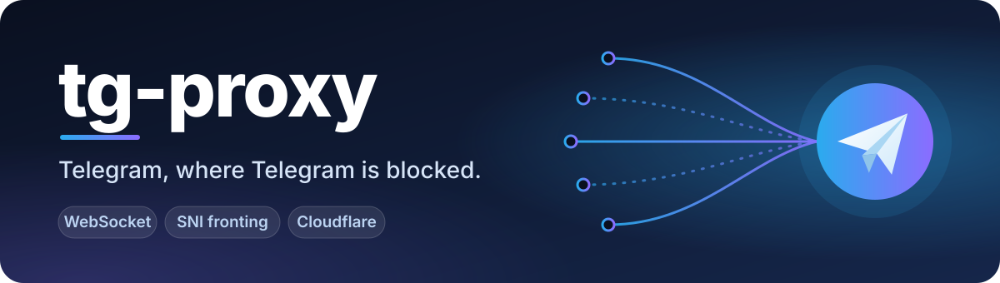
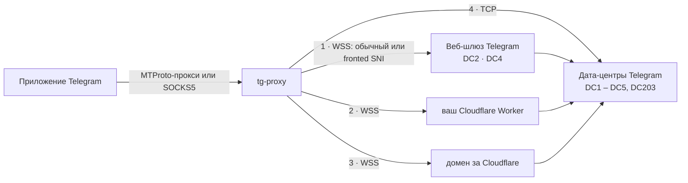

<div align="center">



<br>

**Один небольшой файл. Без аренды сервера, без VPN, без аккаунтов.**<br>
Пускает Telegram по маршрутам, которые цензоры блокируют неохотно, и показывает, какие из них работают именно в *вашей* сети.

<br>

[](https://github.com/AlexMelanFromRingo/tg-proxy/releases)
[](https://github.com/AlexMelanFromRingo/tg-proxy/actions)
[](LICENSE)
[](https://www.rust-lang.org)
[](docs/FUNDING.md)

[English](README.md) · **Русский**

</div>

---

## Что умеет

- 🛰️ **Пять маршрутов в одном прокси.** Прямой WebSocket к собственному шлюзу Telegram, он же с *подменой SNI* (fronting), бесплатный **Cloudflare Worker**, домены за Cloudflare и обычный TCP. Пробуются именно в таком порядке, а неудачи запоминаются: заблокированный путь стоит одной медленной попытки, а не одной на каждое соединение.
- 🩺 **`tg-proxy --check`** делает *настоящее* MTProto-рукопожатие с Telegram по каждому маршруту и показывает, что работает в вашей сети, отдельно по дата-центрам. Больше не нужно гадать.
- 📱 **MTProto-прокси и SOCKS5** в одном процессе. В Telegram добавляется одним кликом по ссылке `tg://proxy`; можно раздать телефонам по Wi‑Fi.
- 🎭 **Fake TLS** (секреты `ee`) с маскировкой активных зондов и защитой от повторов, если вы поднимаете прокси для других.
- 🔗 **Дружит с тем, что уже есть.** `--upstream-socks5` пускает весь трафик через существующий туннель (Xray, sing‑box, Shadowsocks, Tor…).
- 🔒 **Строгость там, где она важна.** Сертификаты проверяются даже в режиме fronting (привязка к `web.telegram.org`); Worker отказывается пропускать что-либо, кроме адресов Telegram; приватные домены в логах маскируются.
- ⚡ Статический бинарник ~4 МБ для Linux, Windows и macOS. Асинхронный Rust, ничего устанавливать не нужно.

## Быстрый старт

1. **Скачайте** файл для своей системы со страницы [Releases](../../releases) (Linux x86‑64/arm64, Windows, macOS Intel/Apple Silicon).
2. **Запустите:**

   ```bash
   chmod +x tg-proxy-linux-x86_64 && ./tg-proxy-linux-x86_64     # Linux / macOS
   tg-proxy-windows-x86_64.exe                                   # Windows
   ```

3. **Нажмите на ссылку `tg://proxy?…`, которую он напечатает** (или вставьте её в любой чат Telegram и нажмите). Telegram предложит добавить прокси: подтвердите.

```
  ╭───────────────────────────────────────────────────────╮
  │  tg-proxy v0.2.0                                      │
  │  Telegram over WebSocket · SNI fronting · Cloudflare  │
  ╰───────────────────────────────────────────────────────╯

  MTProto proxy   127.0.0.1:1443
  SOCKS5 proxy    127.0.0.1:1080
  Routes          direct WS (DC2, DC4) + SNI fronting → CF proxy (community pool) → raw TCP
  Secret          saved in ~/.config/tg-proxy/secret

  Add to Telegram (click the link or paste it into a chat):
    tg://proxy?server=127.0.0.1&port=1443&secret=dd…
    tg://socks?server=127.0.0.1&port=1080
```

Секрет создаётся один раз и запоминается, поэтому ссылка остаётся рабочей после перезапуска.

> **Не работает?** Сначала запустите `tg-proxy --check`: он покажет, какие маршруты достают до Telegram из вашей сети и какие дата-центры покрыты. См. [Если не работает](#если-не-работает).

## Как это устроено



Клиенты Telegram говорят на MTProto, который цензоры легко распознают. `tg-proxy` заворачивает его в обычный HTTPS/WebSocket-трафик к адресам, которые дорого блокировать, и пробует альтернативы, когда один путь перекрыт. Трафик остаётся зашифрованным MTProto от вашего приложения до серверов Telegram; ничто на пути (включая Cloudflare) не может прочитать переписку.

| Маршрут | Что видит цензор | Что нужно от вас | Покрывает |
|---|---|---|---|
| **1 · Прямой WebSocket** | HTTPS к веб-шлюзу Telegram | ничего | DC2, DC4 |
| **1b · …с подменой SNI** | HTTPS на тот же IP под безобидным именем сервера (включается автоматически, если обычные соединения режут) | ничего | DC2, DC4 |
| **2 · Cloudflare Worker** | HTTPS на `*.workers.dev` | бесплатный аккаунт Cloudflare, 5 минут → [инструкция](docs/CLOUDFLARE.ru.md) | все DC |
| **3 · Домены за Cloudflare** | HTTPS на домен, размещённый в Cloudflare | ничего (общий пул) или свой домен | зависит от домена |
| **4 · Обычный TCP** | MTProto на IP Telegram | ничего | все DC |

### Какие аккаунты это покрывает?

Каждый аккаунт Telegram живёт в одном дата-центре, DC1–DC5. WebSocket-шлюз Telegram обслуживает **только DC2 и DC4** (проверено на боевом шлюзе), поэтому аккаунты в **DC1, DC3, DC5** (и новом DC203) зависят от маршрутов 2–4. Вот почему [Cloudflare Worker](docs/CLOUDFLARE.ru.md) стоит настроить, если прямой путь у вас заблокирован: это единственный маршрут, который достаёт до всех дата-центров и не зависит от чужой инфраструктуры.

### Чего он не умеет

- **Голосовые и видеозвонки** не проходят ни через какие MTProto-прокси. Для звонков нужен VPN.
- **Полную блокировку.** Если сеть режет и все адреса Telegram, *и* все адреса Cloudflare, никакой прокси такого рода не поможет. `--check` скажет об этом прямо.

## Если не работает

```bash
tg-proxy --check
```

```
  Direct WebSocket to Telegram's gateway
    ✘ DC2 plain SNI (kws2.web.telegram.org)         timeout
    ✔ DC2 SNI fronting (sprin*****.ru)              190 ms
  Cloudflare Worker
    ✔ DC1 via my-r****.exa****.wor****.dev          355 ms
    …
  Datacenters
    ✔ DC1    worker
    ✔ DC2    fronted, worker
    ✘ DC3    no working route
```

| Что вы видите | Что это значит | Что делать |
|---|---|---|
| Direct ✘, fronted ✔ | Обычные соединения режут, fronting проходит | Ничего: он включается автоматически |
| Direct ✘ и fronted ✘ | Шлюз Telegram недоступен | Настройте [Cloudflare Worker](docs/CLOUDFLARE.ru.md) |
| У некоторых DC стоит ✘ | Аккаунты в этих дата-центрах не подключатся | Добавьте Worker или `--upstream-socks5` |
| Везде ✘ и `timeout` | Нет связи вообще или доступны только сайты из белого списка | Проверьте базовое подключение; попробуйте `--upstream-socks5` |

## Рецепты

<details>
<summary><b>📱 Использовать на телефоне (та же Wi‑Fi сеть)</b></summary>

```bash
tg-proxy --host 0.0.0.0
```

Он напечатает ссылку `tg://proxy` с LAN-адресом вашего компьютера. Откройте её на телефоне. MTProto-порт защищён секретом; у SOCKS5-порта **пароля нет**, поэтому в общих сетях отключайте его: `--port 0`.
</details>

<details>
<summary><b>☁️ Добавить Cloudflare Worker (достаёт до всех дата-центров)</b></summary>

Пройдите [docs/CLOUDFLARE.ru.md](docs/CLOUDFLARE.ru.md), затем:

```bash
tg-proxy --cfproxy-worker-domain my-relay.my-name.workers.dev
```

Можно указать несколько Worker'ов (повторите флаг или перечислите через запятую), чтобы распределить нагрузку. Один Worker может обслуживать всех ваших друзей: делитесь только его адресом.
</details>

<details>
<summary><b>🔗 Пустить всё через уже существующий туннель</b></summary>

Если на машине уже работает Xray, sing‑box, клиент Shadowsocks или Tor и у него есть локальный SOCKS5-порт:

```bash
tg-proxy --upstream-socks5 127.0.0.1:10808
tg-proxy --upstream-socks5 user:password@127.0.0.1:10808     # с авторизацией
```

Каждое исходящее соединение (Telegram, Cloudflare, загрузка списка доменов) пойдёт через него, а имена хостов будут разрешаться туннелем, а не локально.
</details>

<details>
<summary><b>🎭 Поднять для других с Fake TLS</b></summary>

```bash
tg-proxy --host 0.0.0.0 --mtproto-port 443 --fake-tls-domain example.com --secret <32 hex-символа>
```

Клиенты получат ссылку `ee…`; зонды, не прошедшие проверку, прозрачно пересылаются на настоящий `example.com`. Подробности, `nginx` и PROXY protocol: [docs/FAKE_TLS.ru.md](docs/FAKE_TLS.ru.md).
</details>

<details>
<summary><b>🐳 Docker</b></summary>

```bash
docker build -t tg-proxy .
docker run -d --name tg-proxy --restart unless-stopped \
  -p 1443:1443 -e TG_PROXY_SECRET=$(openssl rand -hex 16) tg-proxy
```

Образ слушает `0.0.0.0` и не поднимает SOCKS5 (умолчания `TG_PROXY_HOST` / `TG_PROXY_PORT`). Опции добавляйте после имени образа или переменными `TG_PROXY_*` (см. таблицу ниже), например `docker run … tg-proxy --cfproxy-worker-domain relay.example.workers.dev`. Если секрет не зафиксирован, он меняется при каждом запуске контейнера.
</details>

<details>
<summary><b>🧰 Запуск как служба (systemd)</b></summary>

```ini
# /etc/systemd/system/tg-proxy.service
[Unit]
Description=tg-proxy
After=network-online.target
Wants=network-online.target

[Service]
ExecStart=/usr/local/bin/tg-proxy --host 0.0.0.0 --port 0
Environment=TG_PROXY_SECRET=00112233445566778899aabbccddeeff
Restart=on-failure
DynamicUser=yes
NoNewPrivileges=yes

[Install]
WantedBy=multi-user.target
```
</details>

## Опции

Там, где указана переменная окружения, опцию можно задать и ею.

| Опция | По умолчанию | Описание |
|---|---|---|
| `--host` · `TG_PROXY_HOST` | `127.0.0.1` | Адрес прослушивания. `0.0.0.0` открывает прокси в вашей сети. |
| `--mtproto-port` · `TG_PROXY_MTPROTO_PORT` | `1443` | Порт MTProto-прокси (`0` = выкл). |
| `-p, --port` · `TG_PROXY_PORT` | `1080` | Порт SOCKS5 (`0` = выкл). |
| `--secret` · `TG_PROXY_SECRET` | создаётся и запоминается | Секрет MTProto, 32 hex-символа. |
| `--check` | | Проверить все маршруты до Telegram и выйти. |
| `--cfproxy-worker-domain` · `TG_PROXY_WORKER_DOMAINS` | | Ваш Cloudflare Worker (повторяйте или через запятую). |
| `--cfproxy-domain` · `TG_PROXY_CF_DOMAINS` | общий пул | Ваш собственный домен за Cloudflare. |
| `--no-cfproxy` | | Не использовать домены за Cloudflare (без стороннего пула). |
| `--no-secure` | | Ходить к Worker / CF-доменам по обычному порту 80 вместо TLS. |
| `--upstream-socks5` · `TG_PROXY_UPSTREAM_SOCKS5` | | Весь исходящий трафик через `[user:pass@]host[:port]`. |
| `--dc-ip DC:IP` | `2:149.154.167.220 4:149.154.167.220` | Шлюз для дата-центра (можно повторять). Голый `--dc-ip` отключает прямые соединения. |
| `--no-direct` | | То же, что голый `--dc-ip`. |
| `--fronting-sni` / `--no-fronting` | `sprinthost.ru` | SNI на случай, когда обычные соединения режут / отключить fronting. |
| `--fake-tls-domain` · `TG_PROXY_FAKE_TLS_DOMAIN` | | Включить Fake TLS под видом этого сайта. |
| `--proxy-protocol` | | Ждать заголовок PROXY protocol v1 (за nginx/haproxy). |
| `--force-test-dc` | | Слать всё на *тестовые* дата-центры Telegram. |
| `--pool-size` / `--pool-max-age` | `4` / `120` | Заранее открытых WebSocket-соединений на DC / их срок жизни (с). |
| `--connect-timeout` | `5` | Таймаут прямого подключения (с). |
| `--buf-kb` | `256` | Размер буфера сокета. |
| `--log-file`, `--log-max-mb`, `--log-backups` | | Дублировать лог в файл с ротацией. |
| `-v, --verbose` | | Подробный лог. |
| `--skip-tls-verify` | | ⚠️ Отключить проверку сертификатов. Небезопасно. |

## Безопасность и приватность

- **По умолчанию только локально.** Прокси слушает `127.0.0.1`. Если привязать его к `0.0.0.0`, SOCKS5-порт откроется без пароля: держите его в доверенных сетях или отключите через `--port 0`.
- **SOCKS5-passthrough отказывается ходить на loopback, частные и link-local адреса**, поэтому SOCKS5-порт, открытый в вашей сети, нельзя использовать для доступа к самой машине с прокси или к вашей локальной сети.
- **Содержимое остаётся приватным.** MTProto шифрует сообщения между вашим приложением и серверами Telegram. Cloudflare, Worker, CF-домен или туннель видят *метаданные* (что вы подключаетесь, сколько и когда), но не содержимое.
- **Общий пул доменов — это чужая инфраструктура.** «Из коробки» маршрут 3 использует пул доменов за Cloudflare, который ведёт оригинальный проект [`tg-ws-proxy`](https://github.com/Flowseal/tg-ws-proxy); список обновляется раз в час из его репозитория. Если не хотите зависеть от него: `--no-cfproxy`, либо подключите свой домен / Worker.
- **Сертификаты проверяются всегда**, в том числе в режиме fronting, где имя на проводе не совпадает с проверяемым (проверка привязана к `web.telegram.org`). `--skip-tls-verify` отключает проверку и нужен только для отладки.
- **Worker не открытый ретранслятор.** [`cloudflare/worker.js`](cloudflare/worker.js) отклоняет любые адреса вне опубликованных диапазонов Telegram.
- **Секреты не попадают в логи.** Ссылки подключения (в них секрет) выводятся только в консоль, в файл лога не пишутся. Приватные домены и SNI в строках лога маскируются. Файл с секретом на Unix создаётся с правами только для владельца.
- **Устойчивость к зондам.** При Fake TLS всё, что не прошло проверку (сканеры, активные зонды, *повторы* перехваченного hello), пересылается на настоящий сайт.

## Сборка и тесты

```bash
cargo build --release          # → target/release/tg-proxy   (Rust 1.85+)
cargo test                     # юнит- и сквозные тесты на локальных заглушках
cargo test --test e2e -- --ignored live      # плюс разговор с настоящим Telegram
```

Сквозные тесты запускают настоящий прокси против заглушек инфраструктуры Telegram (TLS-шлюз, дата-центр, Worker, SOCKS5-апстрим) и проверяют перешифрование, разбиение пакетов, fronting, привязку сертификата, зонды и повторы Fake TLS, порядок fallback и здоровье пула.

## Благодарности и отличия

`tg-proxy` — реализация на Rust подхода, предложенного проектом [**Flowseal/tg-ws-proxy**](https://github.com/Flowseal/tg-ws-proxy) (MIT), который, в свою очередь, вдохновлён [WSProxy от Nekogram](https://github.com/Nekogram/WSProxy). Спасибо обоим.

Перенесено: режим MTProto-прокси с перешифрованием, Fake TLS с маскировкой, PROXY protocol, прямой WebSocket с пулом и подменой SNI, маршруты Cloudflare Worker и доменов за Cloudflare с общим пулом, тестовые дата-центры, DC203, ротация логов, маскировка доменов в логах. Не перенесено: GUI в трее для Windows/macOS, автозапуск и проверка обновлений: это консольная программа.

Сверх оригинала: `--check`; `--upstream-socks5`; fronting проверяется по `web.telegram.org` вместо принятия любого сертификата; защита Fake TLS от повторов; Worker, ограниченный Telegram; постоянный секрет; параллельный опрос доменов Cloudflare вместо одного за раз; кадры WebSocket разбираются из буфера (на ping отвечаем сразу, частичное чтение ничего не теряет); переменные окружения для всех основных опций.

## Поддержать проект

Проект бесплатный и под лицензией MIT. Если он помог сохранить Telegram рабочим, можно поддержать разработку криптовалютой: адреса в **[docs/FUNDING.md](docs/FUNDING.md)** ❤️

## Лицензия

[MIT](LICENSE)
